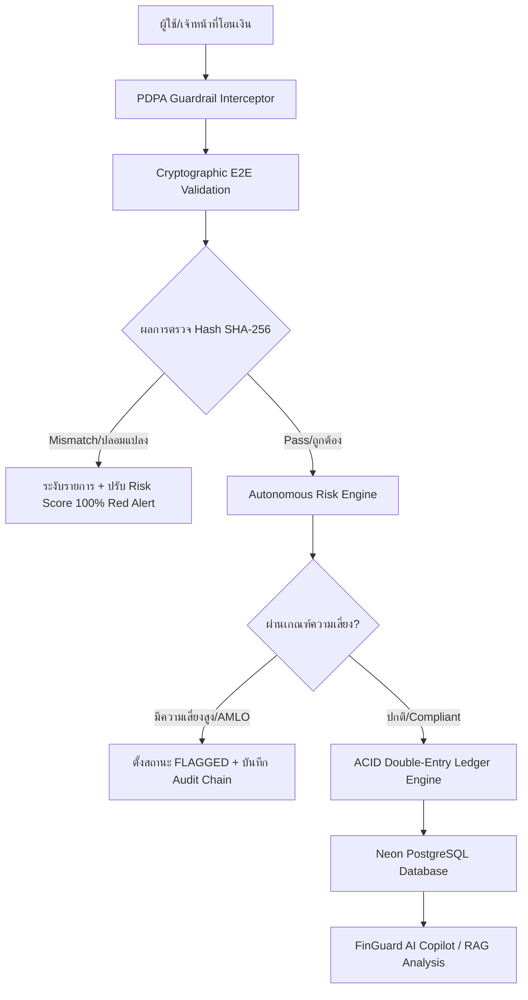

# รายงานสรุปภาพรวมโปรเจกต์ FinGuard AI (Project Architecture & Engineering Summary)

## 1. FinGuard AI คือระบบอะไร? (System Overview)
**FinGuard AI** คือ **ระบบกำกับดูแลการทำธุรกรรมทางการเงินและตรวจสอบความเสี่ยงแบบอัตโนมัติ (Autonomous Financial Compliance & Real-Time Transaction Intelligence Platform)** ออกแบบมาสำหรับกลุ่มธุรกิจสถาบันการเงิน ธนาคาร (BFSI - Banking, Financial Services, and Insurance) และระบบชำระเงินดิจิทัล

ระบบทำหน้าที่เป็น **"เกราะป้องกันและผู้ช่วยอัจฉริยะ (AI Copilot & Guardrail)"** ที่เข้ามากำกับดูแลทุกรายการโอนเงิน การกระทบยอด บัญชีม้า และการกำกับดูแลตามกฎหมายทางการเงินของประเทศไทยและสากลแบบเรียลไทม์ ก่อนที่เงินหรือรายการบัญชีจะถูกบันทึกสำเร็จ

---

## 2. จุดประสงค์หลักของโปรเจกต์ (Core Objectives)
โปรเจกต์นี้ถูกสร้างขึ้นเพื่อแก้ปัญหาหลัก 4 ประการในระบบธนาคารและการเงินยุคปัจจุบัน:

1. **การกำกับดูแลตามกฎหมายแบบอัตโนมัติ (Automated Regulatory Enforcement):**
   - ตรวจสอบและบังคับใช้เกณฑ์ของ **ธนาคารแห่งประเทศไทย (BOT)** เช่น รายการโอนเงินมูลค่าสูงเกิน 500,000 บาท
   - ตรวจสอบเกณฑ์ของ **สำนักงานป้องกันและปราบปรามการฟอกเงิน (ปปง. / AMLO)** สำหรับรายการที่ต้องสงสัยหรือมีมูลค่าตั้งแต่ 2,000,000 บาทขึ้นไป (Suspicious Transaction Report - STR)
   - ป้องกันภัยทุจริตทางการเงินตามมาตรการแก้ไขปัญหาบัญชีม้า (BOT-FRAUD-2567)

2. **ความถูกต้องสมบูรณ์แบบของระบบบัญชีคู่ (Double-Entry ACID Ledger Consistency):**
   - รับประกันว่าทุกรายการโอนเงินระหว่างบัญชีเดบิต (Debit) และเครดิต (Credit) ต้องมีดุลยภาพทางคณิตศาสตร์ที่เป็นศูนย์ (Zero-Drift Balance)
   - ป้องกันปัญหาการถอนเงินเกินบัญชี (Overdraft Protection) และปัญหาการประมวลผลพร้อมกัน (Race Conditions)

3. **การคุ้มครองข้อมูลส่วนบุคคล (PDPA Compliance by Design):**
   - บังคับใช้มาตรการเซ็นเซอร์ข้อมูลลับอัตโนมัติ (Auto-PII Masking) ตาม **พ.ร.บ.คุ้มครองข้อมูลส่วนบุคคล พ.ศ. 2562 (PDPA)** เช่น เลขบัตรประชาชน 13 หลัก, เลขหน้าบัตรเครดิต/เดบิต (PAN), เบอร์โทรศัพท์ และอีเมล ก่อนบันทึกข้อมูลลงฐานข้อมูล หรือส่งให้ระบบ AI วิเคราะห์

4. **ตรวจสอบย้อนกลับได้แบบแก้ไมโคร/ปลอมไม่ได้ (Cryptographic Non-Repudiation Audit Chain):**
   - บันทึก ประวัติการทำธุรกรรมและการเข้าถึงข้อมูลทั้งหมดลงใน Audit Log ที่เชื่อมต่อกันด้วยรหัส SHA-256 ในลักษณะบล็อกเชน (Blockchain-Style Linked-List Chain) หากมีใครแอบแก้ไขข้อมูลในฐานข้อมูล ระบบจะแจ้งเตือนทันที

---

## 3. หลักการทำงานของระบบ (System Architecture & Working Principles)

ระบบ FinGuard AI ทำงานเป็นลำดับขั้น (Pipeline Execution) ตั้งแต่ผู้ใช้ส่งคำขอโอนเงิน จนถึงการบันทึกบัญชีและการวิเคราะห์ด้วย AI:

### ขั้นตอนการทำงานรายละเอียด:
1. **การกรองข้อมูล PDPA (Data Protection Interceptor):**
   - เมื่อมีข้อมูลการทำธุรกรรมเข้ามา ระบบจะสแกนและเซ็นเซอร์ข้อมูลส่วนบุคคลด้วย Regular Expression (Regex) เช่น เปลี่ยน `1-1004-99882-12-9` เป็น `1-XXXX-XXXXX-XX-9`
2. **การตรวจสอบความถูกต้องของรหัสผ่านต้นทาง-ปลายทาง (End-to-End Cryptographic Validation):**
   - ระบบจะสร้าง Hash SHA-256 256-bit ของข้อมูลการโอนจากโหนดต้นทาง (`sourceCryptHash`) และโหนดปลายทาง (`destinationCryptHash`)
   - หากพบว่า Hash ไม่ตรงกัน (Hash Mismatch) ระบบจะถือว่ามีการปลอมแปลงข้อมูลระหว่างทางทันที
3. **การประเมินความเสี่ยงอัตโนมัติ (Autonomous Risk Engine):**
   - คำนวณคะแนนความเสี่ยง (Risk Score 0.0 - 1.0) จากปัจจัยต่างๆ เช่น มูลค่าเงิน, ประเภทการโอน (โอนในประเทศ / โอนข้ามประเทศ), ความถี่การโอน (Velocity Burst) และตรวจสอบรายชื่อบัญชีต้องสงสัย
4. **การบันทึกบัญชีคู่แบบ ACID (ACID Double-Entry Settlement):**
   - ทำงานภายใต้ Database Transaction ของ Prisma หากตรวจสอบผ่าน ยอดเงินของฝั่งโอนจะถูกหัก (Debit) และยอดเงินฝั่งรับจะเพิ่มขึ้น (Credit) ในคำสั่งเดียวกัน หากขั้นตอนใดล้มเหลว ระบบจะทำการ Rollback ยอดเงินทั้งหมดกลับสภาพเดิมทันที
5. **การสร้างบล็อกเชนสำรองตรวจสอบ (Immutable Hash Audit Chain):**
   - ทุกกิจกรรมจะถูกนำไปต่อท้าย Audit Chain โดยนำ `previousHash` ของบล็อกก่อนหน้ามาคำนวณร่วมกับ `payloadHash` ปัจจุบัน ได้รหัส `entryHash` ใหม่ที่ไม่สามารถย้อนกลับหรือแก้ไขได้

---

## 4. เทคโนโลยีที่ใช้ในการแก้ปัญหา (Tech Stack & Solution Engineering)

| สถาปัตยกรรม / ส่วนประกอบ | เทคโนโลยีที่เลือกใช้ | เหตุผลและโซลูชันในการแก้ปัญหา |
| :--- | :--- | :--- |
| **Core Framework** | Next.js 15 (App Router), React 19, TypeScript | ให้ประสิทธิภาพการแสดงผลความเร็วสูง รองรับ Server Actions และ Edge Runtime |
| **Database & Persistence** | Neon Serverless PostgreSQL | ฐานข้อมูล PostgreSQL บนคลาวด์ รองรับ PgBouncer Connection Pooling และ extension `pgvector` |
| **ORM & Database Driver** | Prisma ORM 6.4.1 | จัดการประเภทข้อมูลแบบ Strict Type Safety และรองรับ ACID Database Transactions |
| **AI Engine & Compliance RAG** | DeepSeek AI (`deepseek-chat` / `deepseek-reasoner`) | โมเดล AI สำหรับวิเคราะห์กฎหมายทางการเงินและแจ้งคำแนะนำเจ้าหน้าที่ผู้ตรวจสอบ |
| **State Management** | Zustand 5.0 | จัดการ State ของแอปพลิเคชัน ฝั่ง Client พร้อมระบบ Micro-Cache และ Global Sync Event |
| **Styling & UI Components** | Vanilla CSS, TailwindCSS, Lucide Icons | ตกแต่งหน้าจอระดับ Premium Glassmorphism ปรับเข้ากับ Dark/Light mode สวยงาม |

---

## 5. ประวัติการพัฒนาและการแก้ปัญหาที่เกิดขึ้น (Development History & Problem Solving)

ตลอดระยะเวลาการพัฒนา ได้มีการแก้ไขและปรับปรุงระบบตามความต้องการและปัญหาจริงดังนี้:

1. **การแยกหน้าจอทำงานเพื่อความลื่นไหล (Multi-Page Navigation):**
   - *ปัญหาเดิม:* ข้อมูลและปุ่มทำงานรวมกันในหน้าแดชบอร์ดหน้าเดียว ทำให้สับสนและโหลดช้า
   - *การแก้ไข:* แยกหน้าการทำงานชัดเจน 4 หน้า ได้แก่
     1. `DashboardPage` (`/dashboard`): สำหรับดูภาพรวมสถิติ กราฟ และความเสี่ยง
     2. `TellerDeskPage` (`/teller`): สำหรับเจ้าหน้าที่เคาน์เตอร์ทำรายการโอนและออกสลิป
     3. `ReconciliationPage` (`/reconciliation`): สำหรับฝ่ายปฏิบัติการตรวจสอบบัญชีคู่และส่งออก CSV
     4. `AuditExplorerPage` (`/audit`): สำหรับผู้ตรวจสอบดูบล็อกเชน SHA-256
     5. `ComplianceCopilotPage` (`/compliance`): หน้า FinGuard AI สำหรับวิเคราะห์กฎหมาย

2. **ระบบตอบสนองทันทีแบบไม่ต้องรอโหลด (Instant Navigation & Deferred Hydration):**
   - *การแก้ไข:* เมื่อกดเปลี่ยนหน้า ให้เปลี่ยนไปยังหน้านั้นทันทีโดยใช้ข้อมูลจากแคชเดิม (Zustand Cache) จากนั้นจึงดึงข้อมูลสดจากฐานข้อมูลมาอัปเดตเบื้องหลัง (Background Hydration) ทำให้เว็บเร็วและลื่นไหล

3. **ระบบแจ้งเตือนขณะกำลังบันทึก/โหลดข้อมูล (Global Loading Overlay):**
   - *การแก้ไข:* สร้างส่วนประกอบ `TransactionProcessingOverlay` แสดงวงแหวนหมุนจางๆ กลางหน้าจอเมื่อกำลังบันทึกธุรกรรมหรือกดปุ่ม Sync เพื่อให้ผู้ใช้ทราบว่าระบบกำลังประมวลผล และห้ามขึ้นตัวเลขจนกว่าข้อมูลจะมาจริง

4. **ปุ่ม Sync ข้อมูลสดและการแก้ปัญหาความช้าของฐานข้อมูล (Database Performance Tuning):**
   - *ปัญหาเดิม:* การดึงข้อมูลจาก Neon PostgreSQL บนคลาวด์ช้า (ใช้เวลาหลายวินาที) เนื่องจากส่งคำสั่งไปกลับหลายรอบ (Multiple Roundtrips)
   - *การแก้ไข:*
     - เปลี่ยนมาใช้คำสั่ง Raw SQL รวม (`$queryRaw`) ในคำสั่งเดียว ประมวลผลที่ฐานข้อมูลแล้วส่งผลลัพธ์กลับมาทีเดียว
     - แยกการดึงสถานะฐานข้อมูล (`/api/database/status`) ไปทำงานเบื้องหลัง ไม่ให้บล็อกหน้าแดชบอร์ด
     - ปิดการบันทึก Query log ที่ไม่จำเป็นใน Prisma
     - ตั้งค่า PgBouncer connection pooling (`pgbouncer=true&connect_timeout=10&pool_timeout=10`) ทำให้ความเร็วในการดึงข้อมูลลดลงเหลือเพียง **~140 - 250 มิลลิวินาที**

5. **ระบบสร้างบัญชีทดลองโอนเงิน (Random Account Generator):**
   - *การแก้ไข:* เพิ่มปุ่มกดสร้างบัญชีผู้ใช้ทดลองโอนเงินได้เรื่อยๆ โดยระบบจะสุ่ม ID อ้างอิง และสุ่มเลขบัญชีธนาคารไทย 10 หลัก (รูปแบบ `XXX-X-XXXXX-X`) พร้อมชื่อบริษัทสมมติโดยอัตโนมัติ

6. **ระบบจำลองการปลอมแปลงข้อมูลรหัส (Cryptographic Tampering Simulation):**
   - *การแก้ไข:* เพิ่มสวิตช์ทดลองสลับ Hash ปลายทาง เพื่อทดสอบกรณีข้อมูลโดนดักแก้ไขระหว่างทาง รายการนั้นจะถูกเปลี่ยนเป็นสีแดงเตือนทันที ถูกปรับ Risk Score เป็น 100% และถูกบล็อกไม่ให้เงินเข้าบัญชีปลายทาง

---

## 6. สรุปสถานะโครงการปัจจุบัน (Current Status)

- **เวอร์ชันปัจจุบัน:** `v1.2.0` (Production-Ready Architecture)
- **สถานะ:**
  - ระบบบัญชีคู่ ACID และระบบประเมินความเสี่ยงทำงานได้สมบูรณ์ 100%
  - ระบบตรวจสอบ Hash SHA-256 ป้องกันการปลอมแปลงทำงานสมบูรณ์ 100%
  - ระบบเซ็นเซอร์ข้อมูลส่วนบุคคล (PDPA Masking) ทำงานสมบูรณ์ 100%
  - การเชื่อมต่อฐานข้อมูล Neon PostgreSQL มีความเร็วและเสถียรสูง (~200ms)
  - หน้า AI Copilot ปรับชื่อเป็น **FinGuard AI** และพร้อมรองรับ DeepSeek API Key

---

*เอกสารฉบับนี้สร้างขึ้นเพื่อเป็นบันทึกสรุปโครงสร้างสถาปัตยกรรมและหลักการทำงานของโปรเจกต์ FinGuard AI*
